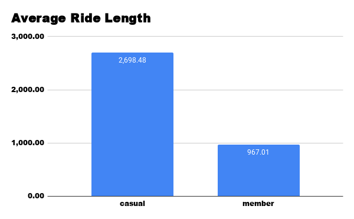
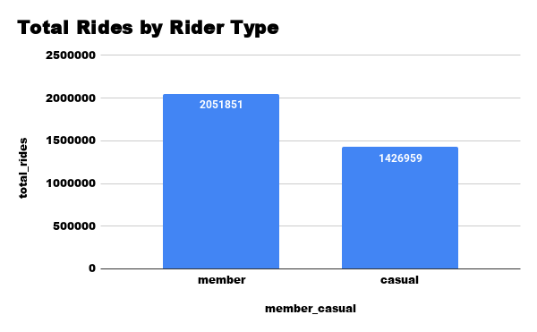
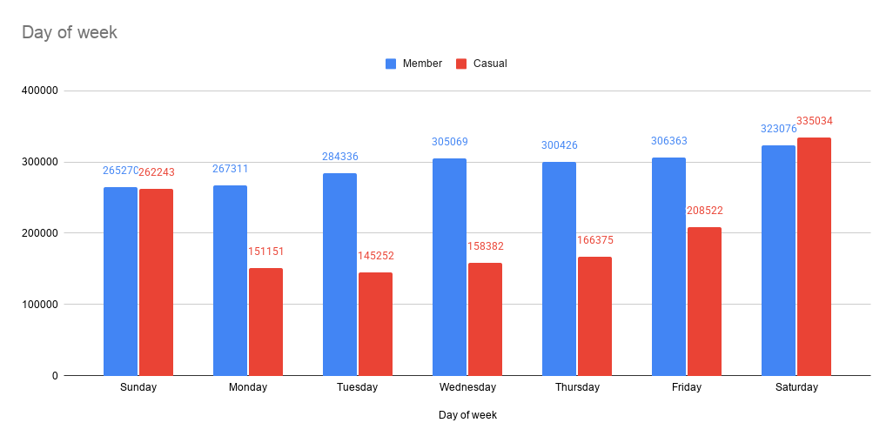

# Cyclist Bike-Share Analysis — SQL Data Analytics Case Study

A data analytics case study exploring how casual riders and annual members use a bike-share service differently. SQL was used to process and analyze historical trip data, with the goal of identifying behavioral patterns that could support a marketing strategy to convert casual riders into members.

## Overview

This project analyzes bike-share trip data to compare two rider segments: casual riders, who pay per ride or day pass, and members, who hold an annual subscription. The analysis focuses on ride duration, total ride volume, and usage patterns across the week.

## Dashboard Preview

Average Ride Length

Total Rides by Rider Type

Rides by Day of Week

## Approach

- Cleaned and aggregated raw trip data using SQL
- Calculated average ride length by rider type
- Compared total ride volume between casual riders and members
- Analyzed ride distribution across days of the week to identify usage trends

## Tech Stack

Data Source: [Bike-share trip data — e.g. Cyclistic/Divvy public dataset]
Data Processing: SQL
Visualization: [Google Sheets / Tableau / Excel]

## Key Findings

Casual riders average significantly longer trips than members — 2,698 seconds (about 45 minutes) compared to 967 seconds (about 16 minutes). This suggests casual riders use the service for leisure rather than commuting.

Members complete more total rides overall — 2,051,851 compared to 1,426,959 by casual riders — pointing to more frequent, routine use.

Casual ridership peaks on weekends, with Saturday and Sunday showing the highest counts, while weekday usage drops considerably. Member ridership stays relatively steady across all seven days, consistent with commuting behavior.

## What I Learned

This project involved writing SQL queries to clean and aggregate a large trip dataset, calculating key metrics by rider segment, and translating the results into insights that could inform a targeted marketing approach — for example, focusing campaigns on weekends when casual ridership is highest.
